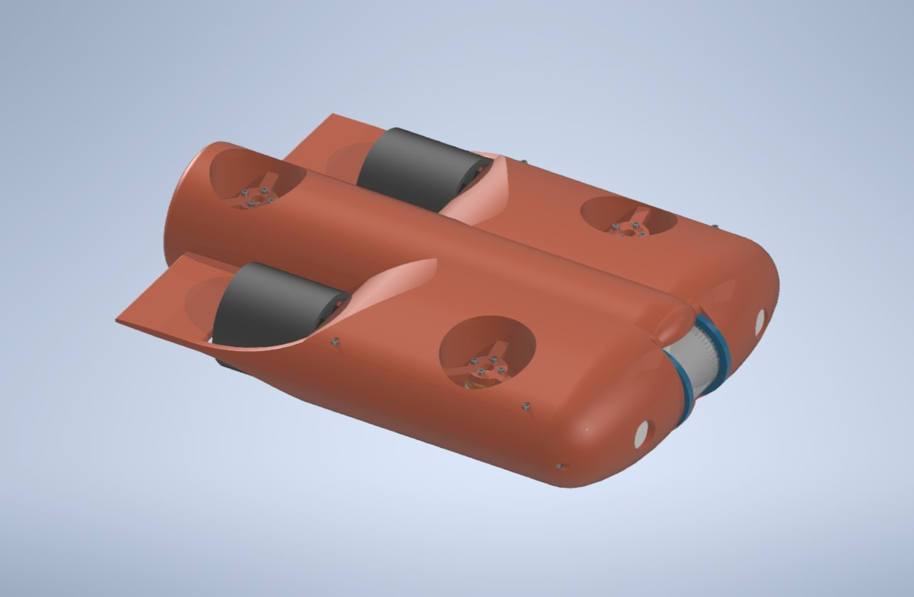
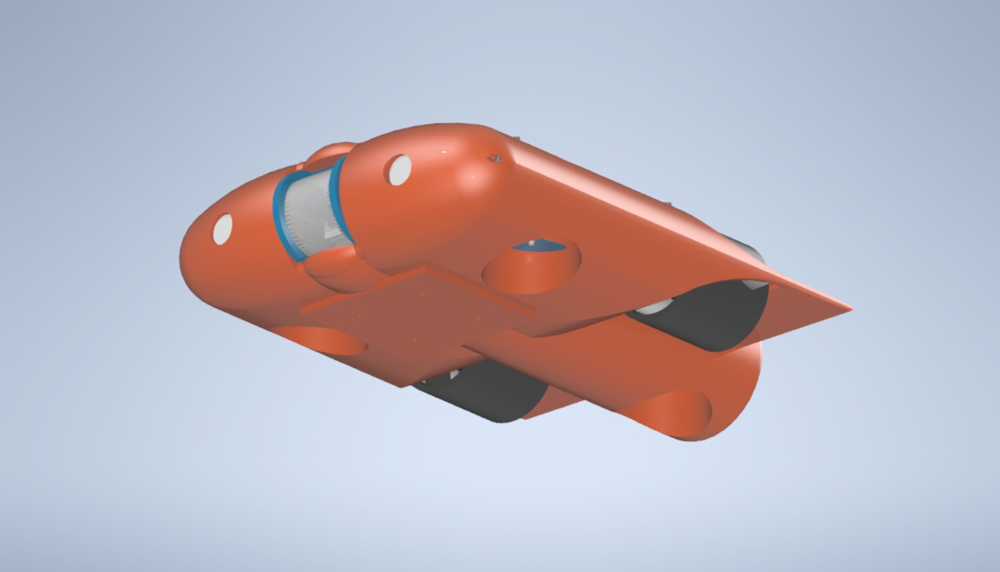

# Underwater_ROV
Remotely Operated Vehicle (ROV), created in Autodesk Inventor for underwater exploration.. It's equipped with a five-thruster system and a forward-facing camera with lighting, The sealed, watertight tube for the electronics is housed safely within the outer body.

[Click here to see Assembly Drawing](ROV-1.pdf)

